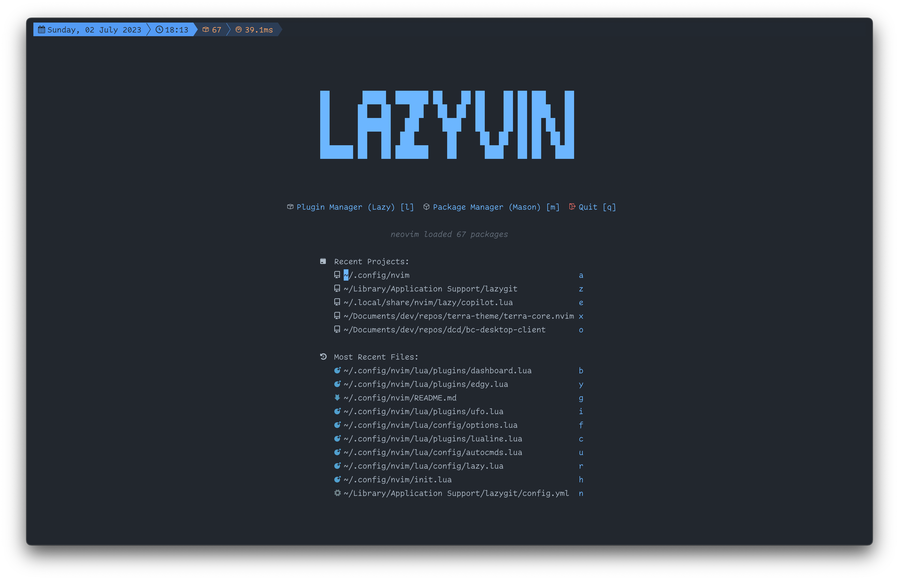

# 🚀 LazyVin

  

Building upon the foundation of my previous config, [Vin](https://github.com/nikbrunner/vin), LazyVin represents the next evolution in my Neovim setup. Designed to leverage the robust capabilities of LazyVim, LazyVin is an endeavor to streamline my coding environment while keeping the essence of my personalized settings alive.

  

## Motivation

My journey with Neovim and 'Vin' has taught me the value of a personalized coding environment. However, maintaining and updating the configuration became a time-consuming endeavor. With over 1700 commits over 2 years, 'Vin' turned out to be a labyrinth of customizations.

LazyVin is a manifestation of my desire to simplify and delegate. By relying on the LazyVim base, the task of updates and maintenance is majorly handled by others, allowing me to focus on what truly matters: coding and learning. LazyVin maintains a minimalistic set of personal changes, keeping the interface clean and uncluttered.

## The Philosophy Behind LazyVin

LazyVin is not just about being 'lazy'. It's about embracing simplicity, minimalism, and effectiveness. It represents my shift from being a configurator to being a user - a user who wants to make the most of their tools without getting lost in them.

With LazyVin, my promise is to keep things simple, lean, and functional. It's a commitment to spend less time tinkering and more time coding, learning, and creating. LazyVin is designed to provide peace of mind, allowing for a focus on the essentials rather than the intricacies of configuration.

## TODO

### Target: Daily Driver

- [x] Setup `README`
- [x] Migrate Plugins
  - [x] Lualine
  - [x] Harpoon
  - [x] vim-tmux-navigator
  - [x] Copilot
  - [x] Ufo or other Folding Method
- [x] Migrate Mappings
- [x] Border for CMP
- [x] Border for Floating Windows
- [x] Explorer Mappings
- [x] Testing
- [x] Copilot Accept with Tab
- [x] Ufo Folding
- [x] Personal startup screen
- [x] Minimal Notifications
- [x] Telescope Settings
  - no preview line
- [x] Disable indent-blankline
- [x] L(LazyVin) Menu Group
- [x] flash.nvim: Jump to line
- [ ] Migrate Telescope Settings (but not all - only keep as least as possible)
- [ ] Fix Tab Indicator in LuaLine
- [ ] ChatGPT

### Midterm Improvements

- [ ] Floating File Tree with `<C-f>`
  - Can't seem to deactive `<C-f>` (Scroll Forward)

### Longterm Improvements

- [ ] Debugger
  - Tried, but it's not working (couldnt connect to localhost)
  - [(651) Run and Debug TypeScript Unit Tests in Neovim](https://www.youtube.com/watch?v=7Nt8n3rjfDY&list=WL&index=1)
- [ ] Edgy (But simple)
- [ ] Vim-Tmux-Navigator without `is_vim` hack

## Links

- [LazyVim/LazyVim: Neovim config for the lazy](https://github.com/LazyVim/LazyVim)
- [LazyVim/LazyVim · Discussions · GitHub](https://github.com/LazyVim/LazyVim/discussions?discussions_q=is:open+vscode)
- [Getting Started | LazyVim](https://www.lazyvim.org/)
